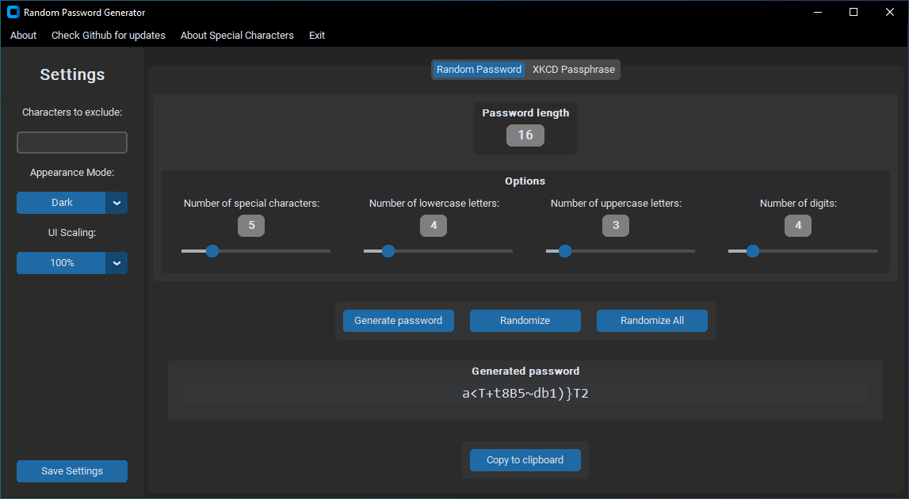
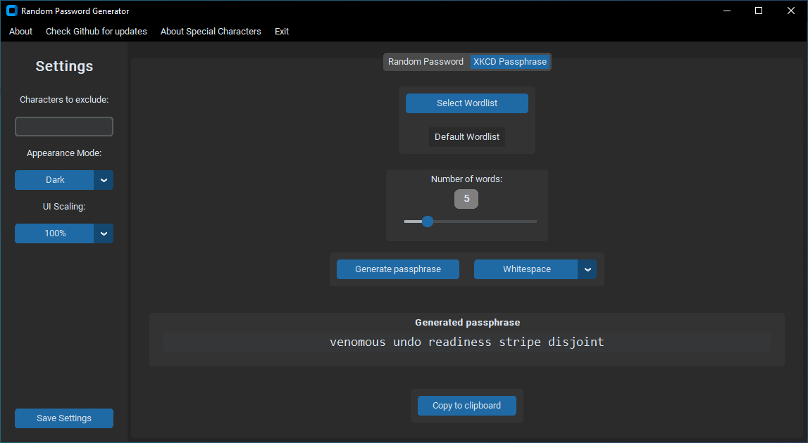

# Random Password Generator

## Overview

This is a simple application for generating random passwords or XKCD-style passphrases, created using the `CustomTkinter` library in Python. The main aim was to learn how to create graphical user interfaces (GUIs), while developing something potentially useful.

> [!NOTE]
> This Python app uses the **`secrets`** module to generate random numbers more securely than the `random` module's pseudo-random number generator, which is designed for modelling and simulation rather than security or cryptography [^1].

## Features
- Settings to:
  - Exclude characters from generation
  - Switch between light and dark mode
  - Limited UI scaling
  - Save settings for next app launch

### Random Passwords
- Adjust desired number of special characters, lowercase letters, uppercase letters and digits
- Option to:
  - Generate password with current slider values
  - Randomize sliders within current password length
  - Randomize sliders and password length
- Generated password can directly be edited
- Option to copy generated password to the clipboard

### XKCD-style Passphrases
- Selection of the wordlist used
- Adjust desired number of words
- Selection of separators between words (*Whitespace*, *No Separator*, *Symbols*, *Digits*, *Symbols + Digits*)
- Option to copy generated password to the clipboard

> [!NOTE]
> To minimise the risk of user errors, the generated password and passphrase is displayed in a font ("_consolas_") that has been specifically chosen to better differentiate between characters that could otherwise easily be confused with each other, such as the lowercase 'L', the uppercase 'I', and the number '1'; or the letter 'O' and the number '0'.

> [!IMPORTANT]
> Please note that some of the generated passwords and passphrases may contain special characters that could be prohibited by certain password policies. In such cases, these should simply be excluded from the generation process using the appropriate field.

## Installation

1. Clone the repository or download the zip file
2. Ensure that you have at least **Python 3.7** installed on your system
3. Navigate to the project directory in your command line interface (CLI) of choice
4. (Optional): create a virtual environment for the dependencies
5. Run `pip install -r /path/to/requirements.txt` to install required dependencies
6. Execute the main script using `python main.py`

## Acknowledgments

- [`TomSchimansky`](https://github.com/TomSchimansky) for creating [CustomTkinter](https://github.com/tomschimansky/customtkinter)
- [`Akascape`](https://github.com/Akascape) for creating the [CTkMenuBar](https://github.com/Akascape/CTkMenuBar), [CTkMessagebox](https://github.com/Akascape/CTkMessagebox) and [CTkToolTip](https://github.com/Akascape/CTkToolTip) extensions
- [`MichaelWehar`](https://github.com/MichaelWehar) for compiling the list of [5000 common words](https://github.com/MichaelWehar/Public-Domain-Word-Lists/blob/master/5000-more-common.txt) (the default list used here) and releasing it into the public domain

## License

Released under [MIT](https://choosealicense.com/licenses/mit/) by
[@jrotzetter](https://github.com/jrotzetter).

This license means:

- You can freely copy, modify, distribute and reuse this software.
- The _original license_ must be included with copies of this software.
- Please _link back_ to this repo if you use a significant portion of
  the source code.
- The software is provided “as is”, without warranty of any kind.

## Disclaimer
There is no guarantee that this application generates actually strong passwords or passphrases. Use at your own risk.

That said, for those interested in password strength, see here for a starting point:
https://www.explainxkcd.com/wiki/index.php/936:_Password_Strength

[^1]: Python Software Foundation. 3.14.0 Documentation » The Python Standard Library » Cryptographic Services » secrets — Generate secure random numbers for managing secrets. https://docs.python.org/3/library/secrets.html#module-secrets. Last accessed 2025-10-10.
