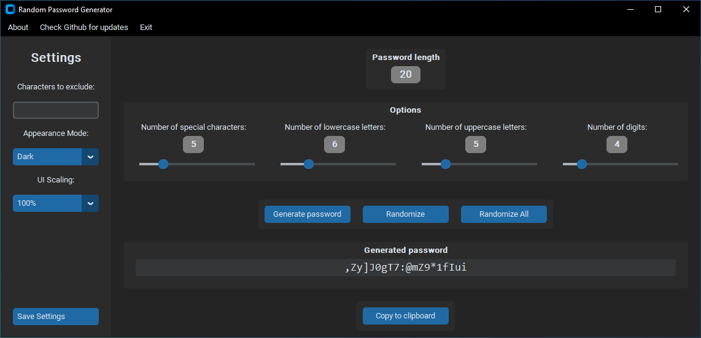

# Random Password Generator

## Overview

This is a simple random password generator application built using the `Tkinter` and `CustomTkinter` libraries in Python. The main aim was to learn how to create graphical user interfaces (GUIs), while also producing something useful.

> [!NOTE]
> This Python app uses the **`secrets`** module to generate random numbers more securely than the `random` module's pseudo-random number generator, which is designed for modelling and simulation rather than security or cryptography [^1].

## Features

- Adjust desired password length, number of special characters, uppercase letters and digits
- Option to copy generated password directly to the clipboard
- Settings to:
  - exclude characters from generation
  - switch between light and dark mode
  - limited UI scaling
  - save settings for next app launch

> [!NOTE]
> To prevent user errors, the generated password is displayed in a font ("_consolas_") chosen to distinguish between characters that could otherwise easily be confused with each other, such as the lowercase 'l', the uppercase 'I', and the number '1', or the letter 'O' and the number '0'.

> [!IMPORTANT]
> Some of the generated passwords may contain special characters that could be prohibited by certain password policies.

## Installation

1. Clone the repository or download the zip file
2. Ensure that you have at least **Python 3.7** installed on your system
3. Navigate to the project directory in your command line interface (CLI) of choice
4. (Optional): create a virtual environment for the dependencies
5. Run `pip install -r /path/to/requirements.txt` to install required dependencies
6. Execute the main script using `python main.py`

## Known Issues

> [!WARNING]
> The time required to generate a password increases significantly when the password becomes longer, without the number of special characters, capital letters and/or numbers being adjusted accordingly.

## Future Plans

- Link password length directly to the slider values
- Possibly rework password generation to improve performance
- Possibly revise password generation to ensure that no characters are repeated and that generated passwords do not start or end with numbers for increased security

## Acknowledgments

- [`TomSchimansky`](https://github.com/TomSchimansky) for creating [CustomTkinter](https://github.com/tomschimansky/customtkinter)
- [`Akascape`](https://github.com/Akascape) for creating the [CTkMenuBar](https://github.com/Akascape/CTkMenuBar) and [CTkMessagebox](https://github.com/Akascape/CTkMessagebox) extensions

## License

Released under [MIT](https://choosealicense.com/licenses/mit/) by
[@jrotzetter](https://github.com/jrotzetter).

This license means:

- You can freely copy, modify, distribute and reuse this software.
- The _original license_ must be included with copies of this software.
- Please _link back_ to this repo if you use a significant portion of
  the source code.
- The software is provided “as is”, without warranty of any kind.

[^1]: Python Software Foundation. 3.14.0 Documentation » The Python Standard Library » Cryptographic Services » secrets — Generate secure random numbers for managing secrets. https://docs.python.org/3/library/secrets.html#module-secrets. Last accessed 2025-10-09.
